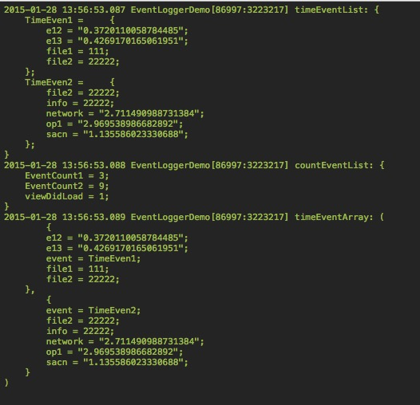

EventLogger
===========

Log event count and event time in iOS

## Installation

The preferred way of installation is via CocoaPods. Just add

```ruby
pod 'EventLogger'
```

and run pod install. It will install the most recent version of EventLogger.

## How to use

### Import header file

Import header file where you want to log event:

```objective-c
#import "EventLogger.h"
```

### Log count event

```objective-c
[[EventLogger sharedInstance] addCountEventWithTag:@"click_clean"];
```

### Log event time

Start Loging `EventCount2`;

```objective-c
[[EventLogger sharedInstance] addCountEventWithTag:@"EventCount2"];
```

Loging `EventCount2` time from event begining;

```objective-c
[[EventLogger sharedInstance] addTimeEventPoint:@"e12" withTag:@"TimeEven1" andInfo:nil timeFromPoint:@nil];
```

Loging `EventCount2` time from point `e13`;

```objective-c
[[EventLogger sharedInstance] addTimeEventPoint:@"e13" withTag:@"TimeEven1" andInfo:nil timeFromPoint:@"e12"];
```

That's it! Have fun with EventLogger!


## ScreenShot


